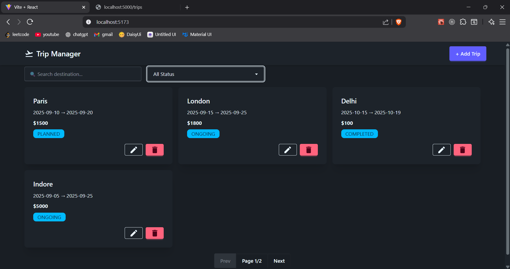

# React + Vite

# 🧳 Trip Manager (React + DaisyUI + JSON Server)

A modern **Trip Management Single Page Application (SPA)** built with **React.js**.  
The project uses **TailwindCSS + DaisyUI** for styling and **Material Icons** for UI elements, along with a **dummy backend (JSON Server)** to demonstrate full **CRUD operations**.  

This app is designed for managing trips with features like **adding new trips, editing existing ones, deleting, searching, filtering, sorting, and pagination**.  

---
## ✨ Features
- ✈️ **Create, Read, Update, Delete (CRUD)** trips  
- 🔍 **Search** trips by destination name  
- 🎯 **Filter** trips by status (PLANNED, ONGOING, COMPLETED)  
- 📅 **Sort** by price or start date  
- 📖 **Pagination** for large trip lists  
- 🎨 **Responsive UI** with DaisyUI + Material Icons  
- 🗄️ **Dummy backend** powered by `json-server`  

---

- Manage trips in an intuitive dashboard  
- Search trips by destination  
- Filter trips by status: `PLANNED`, `ONGOING`, `COMPLETED`  
- Sort trips by **price** or **start date**  
- Paginate results for better UX  
- Responsive design (works on mobile, tablet, desktop)  

---

## 🚀 Demo
[Live Link](https://manage-trip.vercel.app/)

---

## 📂 Project Structure

``` bash
 /src
  /components
    Navbar.jsx
    TripList.jsx
    TripForm.jsx
    SearchFilter.jsx
    Pagination.jsx
  /pages
    Dashboard.jsx
   AddTrip.jsx
    EditTrip.jsx
  /data
    trip.json
  App.jsx
  main.jsx
```

## 📸 Screenshots

Here are some previews of the application:

### Home Page


### Add Route


### Planned status


### OnGoing status


### Completed status


### Search Mumbai


### Delete Paris


### After Delete No Paris Data Show


### Add Gujrat


### After add Search Gujrat


### Page


### Json Data for Backend


## ⚙️ Installation

Frontend Code: 
http://localhost:5173

Backend Code: 
http://localhost:5000/trips

Run on Terminal:

Clone the repo:

```bash
git clone https://github.com/Hariom2312/manage-trip.git
cd manage-trip

npx json-server src\data\trips.json --port 5000

